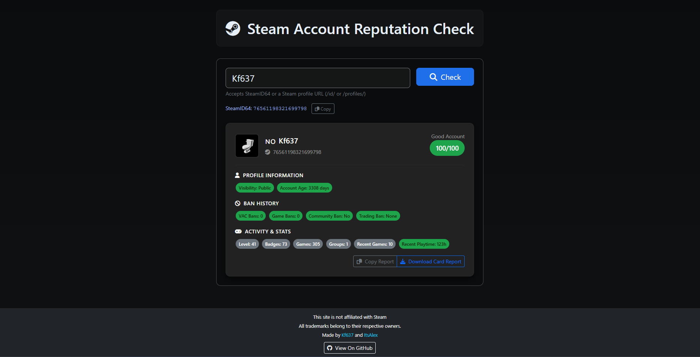

# Steam Account Reputation Check

Preview: https://steamrep.kf637.tech

A lightweight web application for analyzing Steam account reputation through various trust signals including profile data, ban history, account level, community participation, and gaming activity. Simply enter a SteamID64, vanity username, or profile URL to receive a comprehensive trust assessment.

## Features

- **Flexible Input**: Accepts SteamID64, vanity usernames, or Steam profile URLs
- **Comprehensive Analysis**: Evaluates profile completeness, ban history, account level, group memberships, friend connections, and recent gaming activity
- **Trust Scoring**: Generates an algorithmic trust score with descriptive indicators
- **Export Options**: Copy SteamID and generate downloadable reputation reports
- **Rate Limiting**: Built-in protection against API abuse with clear user feedback
- **Privacy Aware**: Handles private profiles gracefully with available public data

## Screenshots



## Getting Started

### Prerequisites

- Steam Web API Key (obtain from https://steamcommunity.com/dev/apikey)
- Docker or Node.js runtime environment

### Installation Methods

#### Option A: Docker (Recommended)

Use the prebuilt container image for quick deployment:

```bash
# Pull the latest image
docker pull ghcr.io/kf637/steam-account-reputation-check:latest

# Run with API key
docker run -p 3100:3100 -e STEAM_API_KEY=YOUR_STEAM_WEB_API_KEY ghcr.io/kf637/steam-account-reputation-check:latest
```

For environment file configuration:

```bash
# Create environment file
echo "STEAM_API_KEY=YOUR_STEAM_WEB_API_KEY_HERE" > .env

# Run with environment file
docker run -p 3100:3100 --env-file .env ghcr.io/kf637/steam-account-reputation-check:latest
```

#### Option B: Docker (Local Build)

Build the container locally from source:

```bash
# Clone repository and navigate to project directory
git clone https://github.com/Kf637/Steam-Account-Reputation-Check
cd steam-account-reputation-check

# Build container
docker build -t steam-rep-check .

# Run container
docker run -p 3100:3100 -e STEAM_API_KEY=YOUR_STEAM_WEB_API_KEY steam-rep-check
```

#### Option C: Node.js (Local Development)

Run directly with Node.js for development:

```bash
# Install dependencies
npm install

# Configure environment
echo "STEAM_API_KEY=YOUR_STEAM_WEB_API_KEY_HERE" > .env

# Start development server
npm start
```

Access the application at `http://localhost:3100`

## Architecture Overview

### Core Components

- **`server.js`**: Express-based HTTP server handling static file serving and Steam API proxy endpoints
- **`index.html`**: Application shell and user interface structure  
- **`steam-trust-app.js`**: Primary client-side application logic and UI state management
- **`lib/steamApi.js`**: Steam Web API client wrapper and request handling
- **`lib/scoring.js`**: Trust score calculation algorithms and reputation metrics
- **`lib/flags.js`**: Country code to flag emoji mapping utilities
- **`style.css`**: Application styling and responsive design
- **`Dockerfile`**: Container build configuration

## Configuration

### Environment Variables

Create a `.env` file in the project root with the following configuration:

```env
STEAM_API_KEY=YOUR_STEAM_WEB_API_KEY_HERE

# Sentry (optional)
# Toggle Sentry (server + client). Default is true if unset.
SENTRY_ENABLED=true
# DSN used by both server and client if enabled
SENTRY_DSN=https://<public-key>@<org>.ingest.sentry.io/<project-id>
# Optional environment label for Sentry (e.g., production, staging, dev)
SENTRY_ENVIRONMENT=production
# Optional tracing sample rate (0.0 - 1.0)
SENTRY_TRACES_SAMPLE_RATE=1.0
# Optional browser SDK loader URL; when omitted a built-in default is used
SENTRY_BROWSER_LOADER_URL=https://js.sentry-cdn.com/<loader-id>.min.js

# Cloudflare Turnstile (optional)
# Enables a popup challenge and stores a 6-hour cookie after successful verification.
TURNSTILE_ENABLED=false
TURNSTILE_SITE_KEY=0x...
TURNSTILE_SECRET_KEY=0x...
# Optional cookie name override (default: cf_turnstile_token)
TURNSTILE_COOKIE_NAME=cf_turnstile_token
```

**Security Note**: The Steam API key is used exclusively server-side and never exposed to client browsers.

### Cloudflare Turnstile

When enabled, a Turnstile popup is shown on first use (or when the cookie expires). After a successful challenge, the server stores a cookie with a 6-hour TTL to avoid re-prompting during that window. If the cookie is missing or cleared, the popup will appear again.

### Rate Limiting

The application implements per-IP rate limiting to ensure API quota compliance and prevent abuse:

| Endpoint | Limit | Window |
|----------|-------|--------|
| Page requests (`/`, `/index.html`) | 100 requests | 60 seconds |
| `/api/resolve-vanity` | 10 requests | 60 seconds |
| `/api/steam-account` | 10 requests | 60 seconds |

When rate limits are exceeded, the server responds with:
- HTTP Status: `429 Too Many Requests`
- Response Body: `{"error": "rate_limited", "retry_after": <seconds>}`
- Header: `Retry-After: <seconds>`

The UI automatically displays retry timing and blocks further requests until the limit resets.

## Trust Score Methodology

The reputation system evaluates multiple account characteristics:

### Scoring Factors

- **Profile Completeness**: Avatar, description, showcase items
- **Account Age**: Registration date and longevity
- **Community Engagement**: Group memberships and friend connections
- **Gaming Activity**: Game library size and recent playtime
- **Account Level**: Steam level and badge collection
- **Ban History**: VAC and community ban status
- **Privacy Settings**: Public vs private profile configuration

### Score Interpretation

- **High Trust (80-100)**: Established accounts with strong community presence
- **Medium Trust (50-79)**: Normal accounts with moderate activity
- **Low Trust (0-49)**: New, limited, or problematic accounts

## API Endpoints

### GET `/api/resolve-vanity?vanity=<name>`
Resolves a vanity username to a SteamID64.

Example response:

```json
{ "steamid": "76561198000000000" }
```

### GET `/api/steam-account?steamid=<steamid64>`
Fetches profile summary, ban info, and extra stats for trust scoring.

Example response:

```json
{
	"player": {
		"steamid": "76561198000000000",
		"personaname": "Example User",
		"profileurl": "https://steamcommunity.com/profiles/76561198000000000/",
		"avatarfull": "https://steamcdn-a.akamaihd.net/...jpg",
		"loccountrycode": "US",
		"communityvisibilitystate": 3
	},
	"ban": {
		"SteamId": "76561198000000000",
		"CommunityBanned": false,
		"VACBanned": false,
		"NumberOfVACBans": 0,
		"NumberOfGameBans": 0,
		"EconomyBan": "none",
		"DaysSinceLastBan": 0
	},
	"extras": {
		"level": 12,
		"badgesCount": 8,
		"friends": 42,
		"games": 120,
		"groups": 5,
		"recentGamesCount": 2,
		"recentMinutes": 180
	}
}
```

Rate limit example (per-IP limit exceeded):

```json
{ "error": "rate_limited", "retry_after": 42 }
```

The server also sets `Retry-After: 42` (seconds). Fields may be null for private profiles.

## Troubleshooting

### Common Issues

**Module Installation Errors**
```
Error: Cannot find module 'dotenv'
```
**Solution**: Ensure all dependencies are installed with `npm install`

**API Configuration Problems**
```
Failed to fetch account information. Please check the Steam API configuration.
```
**Solutions**:
- Verify `.env` file exists with valid `STEAM_API_KEY`
- Check server logs for authentication errors
- Confirm API key has proper permissions

**Rate Limiting Messages**
```
Rate limited — Retry after 42s
```
**Solution**: Wait for the specified duration before making additional requests

**Incomplete Data Display**
- Private Steam profiles limit available data
- The application displays available information with privacy indicators
- Trust scores are calculated using accessible data only

### Debug Mode

Enable verbose logging by setting environment variable:
```env
DEBUG=steam-rep-check:*
```

## Contributing

We welcome contributions to improve the Steam Account Reputation Check tool:

1. Fork the repository
2. Create a feature branch (`git checkout -b feature/improvement`)
3. Commit changes (`git commit -am 'Add new feature'`)
4. Push to branch (`git push origin feature/improvement`)
5. Create a Pull Request

### Development Setup

```bash
# Clone repository
git clone <repository-url>
cd steam-account-reputation-check

# Install dependencies
npm install

# Configure development environment
cp .env.example .env
# Edit .env with your Steam API key

# Start development server
npm run dev
```

## Security Considerations

- Steam API keys are handled server-side only
- Rate limiting prevents API abuse
- Input validation prevents injection attacks
- No user data is stored or logged persistently

## License

This project is licensed under the MIT License - see the [LICENSE](LICENSE) file for details.

## Acknowledgments

Created by [@Kf637](https://github.com/Kf637) and [@ItsAlexIK](https://github.com/ItsAlexIK)
